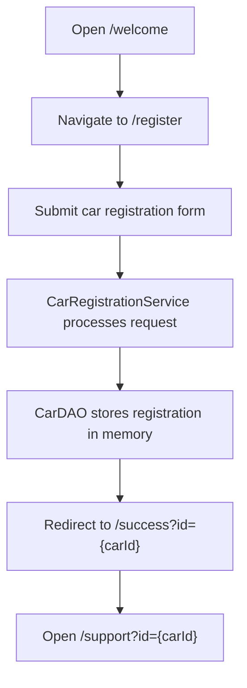

# Car Service Registration

Spring Boot MVC learning project for car-service registration with JSP views, in-memory persistence, and a simple support follow-up flow.

## Overview

This project showcases how a basic service registration workflow can be built using Spring Boot MVC, JSP pages, and layered application design. It is organized as a compact learning project that demonstrates request handling, form submission, service orchestration, repository interaction, and page-based user flow in a beginner-friendly way.

## Concepts and Features Covered

- Spring Boot MVC application setup
- JSP-based view rendering
- Controller-driven navigation and form handling
- Domain, service, and repository layer separation
- In-memory data persistence for submitted registrations
- Registration success flow with support-page navigation
- Unit and MVC-slice tests for key behaviors

## Tech Stack

- Java 17
- Spring Boot 3
- Spring MVC
- JSP / JSTL
- Maven
- JUnit 5

## Project Structure

```text
car-service-registration/
├── CHANGELOG.md
├── README.md
├── pom.xml
├── mvnw
├── mvnw.cmd
└── src/
    ├── main/
    │   ├── java/com/example/CarServicePart_1/
    │   │   ├── CarRegisterationPart_1Application.java
    │   │   ├── domain/
    │   │   ├── repository/
    │   │   ├── service/
    │   │   └── web/
    │   ├── resources/
    │   │   └── application.yml
    │   └── webapp/WEB-INF/jsp/
    │       ├── carregister.jsp
    │       ├── success.jsp
    │       ├── support.jsp
    │       └── welcome.jsp
    └── test/java/com/example/CarServicePart_1/
        ├── repository/
        ├── service/
        └── web/
```

- `domain/`: core vehicle and car model behavior
- `repository/`: in-memory save logic
- `service/`: registration workflow coordination
- `web/`: controllers for welcome, registration, success, and support pages
- `webapp/WEB-INF/jsp/`: JSP views used by the MVC flow

## How to Run

1. Clone the repository.
2. Open a terminal in the project root.
3. Run `mvn test` to verify the project.
4. Run `mvn spring-boot:run`.
5. Open `http://localhost:8080/welcome` in the browser.

## Flow Diagram



## Sample Output

Because this is a web MVC project, the primary output is page-based:

- Welcome page for starting the flow
- Registration form for entering car details
- Success page showing the generated registration ID
- Support page confirming the submitted car ID

## Learning Highlights

- Demonstrates the transition from static page navigation to a multi-step registration workflow
- Shows how service and repository layers improve structure in Spring MVC apps
- Uses simple tests to validate routing, registration behavior, and repository logic
- Preserves earlier project evolution through Git tags: `v1.0.0` and `v2.0.0`

## GitHub Metadata

- Suggested repository description: `Java 17 Spring Boot MVC project that models a car-service registration workflow with JSP views, layered design, and in-memory persistence.`
- Suggested topics: `java`, `java-17`, `spring-boot`, `spring-mvc`, `maven`, `jsp`, `junit5`, `mvc`, `car-service`, `learning-project`, `portfolio-project`
