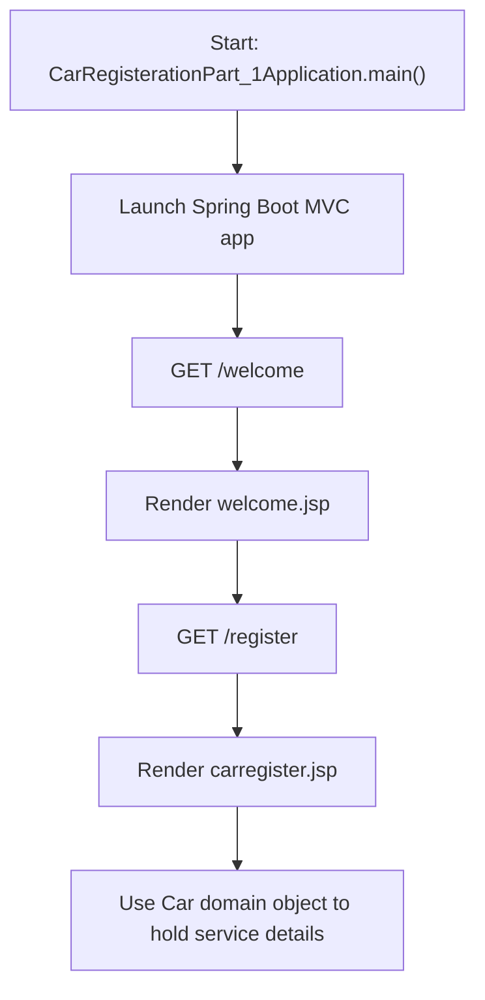

# Car Service Registration

Car Service Registration is a Java 17 Spring Boot MVC project that serves basic JSP pages for a car-service registration flow and includes a simple domain model for vehicle details.

## GitHub Metadata

- Suggested repository description: `Java 17 Spring Boot MVC project for basic car-service registration page navigation and vehicle domain modeling.`
- Suggested topics: `java`, `java-17`, `spring-boot`, `spring-mvc`, `maven`, `jsp`, `junit5`, `web-application`, `car-service`, `learning-project`, `portfolio-project`

## Tech Stack

- Java 17
- Maven
- Spring Boot
- Spring MVC
- JSP / JSTL
- JUnit 5

## Project Overview

The application models a small car-service registration starter:

- `WelcomePageConroller` serves the welcome page.
- `RegisterController` serves the registration page.
- `Car` implements the `Vehicle` interface and stores registration details, car details, and work information.
- JSP views under `src/main/webapp/WEB-INF/jsp` back the page flow.

## Current Flow

1. The application starts in `CarRegisterationPart_1Application`.
2. Spring Boot serves the `/welcome` route for the welcome JSP.
3. The `/register` route serves the registration JSP.
4. The domain model is available for storing car registration and service-work details.

## Flow Diagram



## How To Run

```bash
mvn test
mvn package
java -jar target/car-service-registration-0.0.1-SNAPSHOT.jar
```

Then open [http://localhost:8080/welcome](http://localhost:8080/welcome).

## Known Limitations

- The app currently serves pages only; it does not persist submitted registrations.
- There is no form submission handler or database layer yet.
- Controller coverage is limited to route-to-view behavior in this version.

## Why This Repo Exists

This repository is intended as a learning and portfolio project that shows:

- Spring Boot MVC setup with JSP rendering
- basic route handling with controllers
- simple domain modeling with interfaces
- automated tests for route mapping and domain behavior
