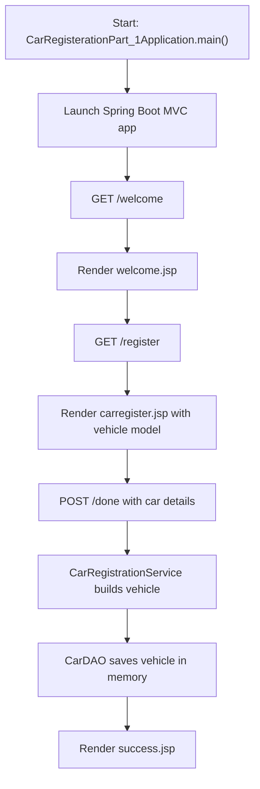

# Car Service Registration

Car Service Registration is a Java 17 Spring Boot MVC project that serves JSP pages for a car-service registration flow and now includes a simple service and repository layer for saving submitted vehicle details in memory.

## GitHub Metadata

- Suggested repository description: `Java 17 Spring Boot MVC project for car-service registration with JSP pages, service/repository layers, and in-memory persistence.`
- Suggested topics: `java`, `java-17`, `spring-boot`, `spring-mvc`, `maven`, `jsp`, `junit5`, `web-application`, `car-service`, `learning-project`, `portfolio-project`

## Tech Stack

- Java 17
- Maven
- Spring Boot
- Spring MVC
- JSP / JSTL
- JUnit 5

## Project Overview

The application models a small car-service registration starter:

- `WelcomePageConroller` serves the welcome page.
- `RegisterController` serves the registration form and processes submitted registration data.
- `CarRegistrationService` coordinates registration through the `Vehicle` domain model.
- `CarDAO` stores submitted cars in memory and returns generated ids.
- `Car` implements the `Vehicle` interface and stores registration details, car details, and work information.
- JSP views under `src/main/webapp/WEB-INF/jsp` back the page flow.

## Current Flow

1. The application starts in `CarRegisterationPart_1Application`.
2. Spring Boot serves the `/welcome` route for the welcome JSP.
3. The `/register` route serves the registration JSP with a new vehicle model.
4. The user submits the form to `/done`.
5. The service layer builds the vehicle and asks the repository layer to save it.
6. The success JSP is shown when the registration succeeds.

## Flow Diagram



## How To Run

```bash
mvn test
mvn package
java -jar target/car-service-registration-0.0.1-SNAPSHOT.jar
```

Then open [http://localhost:8080/welcome](http://localhost:8080/welcome).

## Known Limitations

- Registrations are stored only in memory and are lost when the app stops.
- There is no database or edit/update workflow yet.
- The success flow is covered, but full browser-level form rendering was not live-tested in this environment.

## Why This Repo Exists

This repository is intended as a learning and portfolio project that shows:

- Spring Boot MVC setup with JSP rendering
- controller-based route and form handling
- simple service/repository layering
- domain modeling with interfaces
- automated tests for route mapping, domain behavior, and registration logic
